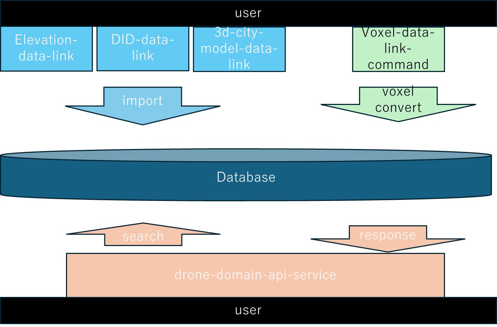

## １．概要

４次元時空間情報基盤を構成する各プロジェクトファイルです。

- メインプロジェクト

    - Elevation-data-link
        - 標高データを登録する
    - DID-data-link
        - 人口集中地区データを登録する
    - 3d-city-model-data-link
        - ３次元都市モデルデータを登録する
    - voxel-data-link-command
        - 標高、人口集中地区、３次元都市モデルからボクセルデータを作成する
    - drone-domain-api-service
        - ドローン領域API。４次元時空間情報基盤　アーキテクチャガイドライン（β版）を参考に構築したＡＰＩ
    　  （https://www.ipa.go.jp/digital/architecture/guidelines/4dspatio-temporal-guideline.html）
　　　
- サブプロジェクト

    サブプロジェクトはメインプロジェクトと同一フォルダでビルドする必要があります。
    - 3d-aip-common
        - 共通ライブラリ
    - 3d-api-dadc-common
        - ドローン領域APIにおけるボクセル情報取得に使用
    - voxel-data-link
        - ボクセルデータ生成における共通ライブラリとして使用
    - mobility-integration-manage
        - ドローン領域APIにおけるボクセル情報検索サービスに使用


## ２．前提環境

本環境はAWS環境構成、EC2にはubuntuOSを前提に作成されています。

各プロジェクト間の関係は図を参照してください。




## ３．データベース作成

  1. 関連OSSインストール

    postgresql16以降のバージョン推奨
    postgis3.4以降のバージョン推奨
    python3系以降のバージョン推奨

  2. 初期テーブル作成(例)


Database作成
```
    # ※td_aip 部分はプログラムのymlファイルで指定する必要があるため、注意
    CREATE DATABASE td_aip
	WITH
	OWNER = postgres
	ENCODING = ‘UTF8’
	LOCALE_PROVIDER = ‘libc’
	IS_TEMPLATE = False;
```

schema作成
```
    # ※td_aip 部分はプログラムのymlファイルで指定する必要があるため、注意
    CREATE SCHEMA td_aip
	AUTHORIZATION postgres;
```
table作成

- 以下[SQL](assets/3d_aip_create_table.sql)を実行する

    3. 初期データ作成

①以下をローカルディレクトリに配置

[空間ID位置テーブル作成用ツール](tools/createInsertQueryForSpaceIdLocation)

②空間ID位置2Dテーブル用のINSERT文ファイルを作成

以下コマンドを実行

```
# 作業ディレクトリに移動
cd /createInsertQueryForSpaceIdLocation

# 起動プログラムファイルを編集
vi createInsertQueryForSpaceIdLocation.py
```

createInsertQueryForSpaceIdLocation.py変更箇所

```

# 作成するボクセルの範囲を指定してください。以下例
# 北(緯度、LAT:大)
NORTH = 37.641666667
# 東(経度、LON:大)
EAST = 141.025000000154
# 上(標高[m]、海抜高度、ALT:大)
HIGH = 200

# 南(緯度、LAT:小)
# SOUTH = 37.6250000002308
# 西(経度、LON:小)
WEST = 141.0
# 下(標高[m]、海抜高度、ALT:小)
LOW = 0

# Zoomレベル
ZOOM=20
# 高度方向が1mになるZoomレベル
ONE_M_ZOOM_LEVEL = 25
# 2Dのテーブル名
TABLE_NAME_2D = 'spatial_id_location_2d'
# 3Dのテーブル名
TABLE_NAME_3D = 'spatial_id_location_3d'
# テーブル名(TABLE_NAME_2DかTABLE_NAME_3Dのどちらか)
TABLE_NAME = TABLE_NAME_2D

```

起動プログラムを実行

```
python3 createInsertQueryForSpaceIdLocation.py
```

③作成されたInsertファイルを実行

```
psql -f insert_spatial_id_location_2d_20XXXXXX_XXXXXX.sql -h localhost -d td_aip -U postgres
```

④空間ID位置3Dテーブル用のINSERT文ファイルを作成

以下コマンドを実行

```
# 作業ディレクトリに移動
cd /createInsertQueryForSpaceIdLocation

# 起動プログラムファイルを編集
vi createInsertQueryForSpaceIdLocation.py
```

createInsertQueryForSpaceIdLocation.py変更箇所

```

# 作成するボクセルの範囲を指定してください。以下例
# 北(緯度、LAT:大)
NORTH = 37.641666667
# 東(経度、LON:大)
EAST = 141.025000000154
# 上(標高[m]、海抜高度、ALT:大)
HIGH = 200

# 南(緯度、LAT:小)
# SOUTH = 37.6250000002308
# 西(経度、LON:小)
WEST = 141.0
# 下(標高[m]、海抜高度、ALT:小)
LOW = 0

# Zoomレベル
ZOOM=20
# 高度方向が1mになるZoomレベル
ONE_M_ZOOM_LEVEL = 25
# 2Dのテーブル名
TABLE_NAME_2D = 'spatial_id_location_2d'
# 3Dのテーブル名
TABLE_NAME_3D = 'spatial_id_location_3d'
# テーブル名(TABLE_NAME_2DかTABLE_NAME_3Dのどちらか)
TABLE_NAME = TABLE_NAME_3D

```


起動プログラムを実行

```
python3 createInsertQueryForSpaceIdLocation.py
```

⑤作成されたInsertファイルを実行

```
psql -f insert_spatial_id_location_3d_20XXXXXX_XXXXXX.sql -h localhost -d td_aip -U postgres
```


## ４．JAVA/gdalインストール

    java17以降のバージョン推奨
    gdal3系以降のバージョン推奨


## ５．各プロジェクトのビルドと実行方法

各プロジェクトreadme参照

- [Elevation-data-link](assets/01_Elevation-data-link_readme.md)
- [DID-data-link](assets/02_DID-data-link_readme.md)
- [3d-city-model-data-link](assets/03_3d-city-model-data-link_readme.md)
- [voxel-data-link-command](assets/04_voxel-data-link-command_readme.md)
- [drone-domain-api-service](assets/05_drone-domain-api-service_readme.md)


## ６．著者

日立製作所


====================================================================================

===============

-  PostgreSQLは、PostgreSQL Community Association of Canadaのカナダにおける登録商標およびその他の国における商標です。

- Javaは、Oracle Corporationおよびその子会社、関連会社の米国およびその他の国における登録商標です。

- Pythonは、Python Software Foundationの登録商標です。

- Amazon EC2 およびその他のAWS 商標は、米国およびその他の諸国におけるAmazon.com,Inc.またはその関連会社の商標です。

- Ubuntuは、Canonical Ltd.の登録商標です。

======================================================================================================

===============
 
